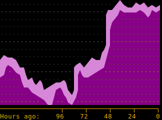

# ILI9341TTY
USB serial TTY for the Arduino Uno with ILI9341 LCD screen shield

<p align="center">

</br>
</br>
<a href="https://vimeo.com/625432715">[video]</a>
</br>
<a href="https://vimeo.com/625432715"></a></br>
</p>

### Semigraphics, ANSI, unicode, and an Arduino LCD-screen terminal

I've been playing with retro-styled interfaces terminal lately. The unicode [box and block drawing characters](https://en.wikipedia.org/wiki/Box-drawing_character) are wonderful for this, especially ["symbols for legacy computing"](https://en.wikipedia.org/wiki/Symbols_for_Legacy_Computing). These include characters from classic computers of the twentieth century, and the block-diagonal [teletext](https://en.wikipedia.org/wiki/Teletext_character_set) characters. These can be combined with [ANSI escape codes for styled and colored text](https://en.wikipedia.org/wiki/ANSI_escape_code#SGR_(Select_Graphic_Rendition)_parameters). Here's an example of a plot rendering in Gnome terminal using the teletext block-diagonal characters and ANSI color codes:

<p align="center">

</p>

***How hard would it be to support these features on an Arduino terminal display?*** This question led me down a rabbit-hole of vt100 terminal emulators on the arduino. 

Getting a basic Arduino [terminal monitor](https://en.wikipedia.org/wiki/VT100) is straigtforward, if building upon a graphics library that supports text rendering. Bodmer [has a nice demo for the Arduino using the Adagruit GFX graphics libraries](https://github.com/Bodmer/TFT_ILI9341/blob/master/examples/TFT_Terminal/TFT_Terminal.ino), and Philippe Lucidarme has [a short-and-sweet demo for the Seeduino](https://lucidar.me/en/arduino/arduino-terminal-on-tft-display/) [(video)](https://www.youtube.com/watch?v=tJgGYW88EpY). Both of these use the ILI9341 touch-screen display, which is commonly available as an Arduino shield.

However, getting good performance with the Arduino is hard. Scrolling requires re-drawing large areas, and is slow. One work-around is to use the ILI9341's built-in vertical scrolling feature. Among the most feature-complete is [Nick Matantsev's TinTTY VT100 emulator for Arduino+ILI9341](https://github.com/unframework/tintty). This includes fast vertical scrolling and a touchscreen keyboard. Nick cites as inspiration this [VT100 emulator for the ILI9340 screen with Arduino](https://github.com/mkschreder/avr-vt100), by Martin K. Schröder. Bodmer's [vertical-scrolling terminal for Arduino+ILI9341](https://www.instructables.com/Arduino-serial-UART-scrolling-display-terminal-usi/) notes that performance can be improved further by optimizing the graphics drivers to write directly to the 8-bit PORTB/C/D registers on the Arduino Uno.

In the broader universe of DIY terminals, Fabrizio Di Vittorio has a [full-featured graphics library for the ESP32](https://github.com/fdivitto/fabgl), which includes an ANSI/VT terminal. James Moxham has explored Arduino terminals with [a wide variety of LCD and LED displays](https://www.instructables.com/A-Collection-of-ANSI-Terminals/). Scargill's tech blog has a [VT-100-esque vertical terminal using a ILI9340 display for the ESP8266](https://tech.scargill.net/an-arduino-terminal/) [(video)](https://www.youfortube.com/watch?v=qBxXZcleKq0). Matthew Sarnoff also has [this beautiful VT100 implementation using an oscilliscope as a display](http://www.msarnoff.org/terminalscope/). I was especially charmed by [ht-deko's implementation](https://github.com/ht-deko/vt100_stm32) of ANSI color and style codes for the STM32F103, which builds upon the work of [cbm80amiga](https://github.com/cbm80amiga/STM32_TFT22_terminal_RRE). 

***Can we get an Arduino terminal that supports enough semigraphics charactes?*** Let's implement a virtual terminal monitor for the Arduino Uno and the ILI9341 LCD display with the following objectives: 

1. Fast enough to be a reasonable output device
2. Support [ANSI escape codes](https://en.wikipedia.org/wiki/ANSI_escape_code) for color and style
3. Interpret incoming data as [utf-8 encoded unicode](https://en.wikipedia.org/wiki/UTF-8#Encoding)
4. Support the [box, block, and legacy computing chracters](https://en.wikipedia.org/wiki/Box-drawing_character)
5. Optimize the drawing commands
6. Squeeze as much unicode onto the Arduino as possible


(sorry for the poor photo quality, digital camera interacts poorly with the screen's narrow view angle; contrast is better in person)


# Version 0.2

Version 0.2 includes some additional unicode characters, including Armenian, Georgian, and Katakana/Hiragana. There was an aborted, incomplete attempt to support devanagari (prefix diacritics would require a bit of extra code to handle). Supported unicode characters are given in [`v0.2/test_terminal/v0p2supported.txt`](https://github.com/michaelerule/ILI9341TTY/blob/main/v0.2/test_terminal/v0p2supported.txt)

<p align="center">

</p>

# How to test it

Download the sketch and upload it onto the Arduino Uno with an Adafruit-style ILI9341 LCD shield.

***Python:***
```python
BAUDRATE = MYBAUDRATE
ARDUINO_PORT_FILE_NAME = "/dev/MYARDUINOSERIALPORT"

import serial
arduino = serial.Serial(port=ARDUINO_PORT_FILE_NAME, baudrate=BAUDRATE, timeout=.1)
time.sleep(3)

def print_arduino(s=''):
        arduino.write(s.encode('utf-8'))

reset = '\x1bc'
print_arduino(reset+'Hello world!')
```

***Bash:***
```bash
> stty -F /dev/MYARDUINOSERIALPORT MYBAUDRATE cr3 ff1 nl1 bs1
> # (wait for arduino to reset)
> echo -e "\x1bcHello World!" >> /dev/MYARDUINOSERIALPORT
``` 

(The flags `cr3 ff1 nl1 bs1` will be explained later)

***Copy the output of a command with `unbuffer`***
```bash
> # (Apt install `expect` to get the `unbuffer` command.) 
> unbuffer ls -w1 --color=auto | tee /dev/MYARDUINOSERIALPORT
``` 

***Send keystrokes with `screen` or `picocom`***

```bash
> screen /dev/MYARDUINOSERIALPORT MYBAUDRATE
``` 

This will open a blank window. Try typing to see if text shows up on the Arduino. To exit, press `Ctrl-A` and release, then press `k` to kill the screen session, then press `y` to confirm. Screen sends Carriage Return (CR;`\r`) instead of Line Feed (LF; `\n` aka newline). [There's no way to change this](https://unix.stackexchange.com/a/672070/134513), but if you install [picocom](https://superuser.com/questions/714078/wrong-newline-character-over-serial-port-cr-instead-of-lf/1492749#1492749) it will play nicely with newlines: 
```bash
picocom /dev/MYARDUINOSERIALPORT --baud YOURBAUDRATE --omap crcrlf --echo
# (press Control+a Control+x to exit)
```


# How mirror terminal output on the Arduino TTY

First, configure the serial device

```bash
> stty -F /dev/MYARDUINOSERIALPORT BAUDRATE ixon cr3 ff1 nl1 bs1
```

You can the output from a command to the Arduino TTY by [redirecting standard output](https://unix.stackexchange.com/a/395194/134513): 

```bash
ls --color=yes > /dev/MYARDUINOSERIALPORT
```

We can also use `tee` to echo the output back to the curent terminal. The echoed output will appear on the main computer immediately, but the command will wait until serial data is finished drawing on the Arduino before exiting.

```bash
ls --color=yes | tee /dev/MYARDUINOSERIALPORT
```

Some commands behave differently when piped through `tee`, however. The command `unbuffer` (apt install expect) can trick them into behaving normally:

```bash
unbuffer ls --color=yes | tee /dev/MYARDUINOSERIALPORT
```

You can list the settings of a tty device using `stty`:

```bash
stty -F /dev/MYARDUINOSERIALPORT -a
```

`stty` can set the number rows and columns on a tty, but this won't work:

```bash
> stty -F /dev/MYARDUINOSERIALPORT MYBAUDRATE rows 20 cols 53
> stty -F /dev/MYARDUINOSERIALPORT -a
speed MYBAUDRATE baud; rows 0; columns 0; ...
```

What does work is setting the `rows` and `columns` on the current virtual terminal in linux. Note that this size will be reset by any window resize events: 

```bash
stty cols 53 rows 20
```

Note how the output of `ls` is correctly wrapped after applying this command:

```bash
# (before applying stty cols 53 rows 20)
> unbuffer ls --color=yes | tee /dev/MYARDUINOSERIALPORT
prepare_fonts  self_contained_Uno9341TFT_TTY_horizontal_v14  test_terminal  writeup
> stty cols 53 rows 20
> unbuffer ls --color=yes | tee /dev/MYARDUINOSERIALPORT
prepare_fonts
self_contained_Uno9341TFT_TTY_horizontal_v14
test_terminal
writeup
```

You can pipe ***all*** output from the shell to the screen by starting a new instance of `bash` and using `tee` to send a copy of `stdout` to the Arduino: 
```bash
> stty -F /dev/MYARDUINOSERIALPORT MYBAUDRATE ixon cr3 ff1 nl1 bs1
> stty cols 53 rows 20
> bash | tee /dev/MYARDUINOSERIALPORT
> # (all output will now be copied to the Arduino TTY )
```


# Dealing with serial buffer overflow 

***If bytes arrive faster than the Arduino can react, the serial buffer will overflow. This leads to dropped bytes.*** To address this, one can
1. Lower the baud rate
2. Increase the serial buffer size [[1](https://www.hobbytronics.co.uk/arduino-serial-buffer-size),[2](https://forum.arduino.cc/t/increase-size-of-serial-buffer/235420),[3](https://forum.arduino.cc/t/solved-serial-buffer-size/581828)]
3. Ensure that the host machine limits the rate at which it sends data
4. Implement [software control flow](https://en.wikipedia.org/wiki/Software_flow_control), which sends `XOFF` (19) to pause and `XON` (17) to resume. <s>These can be enabled on linux by providing the `ixon` argument to stty when configuring the serial connection.</s> (Edit: this may not work for USB serial devices)
5. Ask the host machine to add a small delay after some commands

At the moment, the only guaranteed solution is (1) or (3). Increasing the buffer size (2) can help with transient loads, but still requires the host application to carefully limit its overall data-rate. Software control flow appears to not work on Linux with USB serial, although there may be hacks that work for specific hardware. The additional delays added by (5) are generally too small to make a difference.

### Increasing the serial buffer size

Find the file `HardwareSerial.cpp` in your Arduino installation (`find / -name HardwareSerial.cpp 2>/dev/null`), and open it for editing. You might need `sudo` depending on how Arduino was installed. 
```bash
> vi /usr/share/arduino/hardware/arduino/cores/arduino/HardwareSerial.cpp
```
Find this section (lines 58-62 for me):
```C
#if (RAMEND < 1000)
  #define SERIAL_BUFFER_SIZE 16
#else
  #define SERIAL_BUFFER_SIZE 64
#endif
```
Change the second `#define SERIAL_BUFFER_SIZE 64` to something large, perhaps `#define SERIAL_BUFFER_SIZE 256`.
```C
#if (RAMEND < 1000)
  #define SERIAL_BUFFER_SIZE 16
#else
  #define SERIAL_BUFFER_SIZE 256
#endif
```

### Software control flow (probably won't work)

Ostensibly, it should be possible to request that the kernel use software control flow. In this mode, the Arduino should be able to send the byte `XOFF (19)` to pause transmission, and `XON (17)` to resume it. It is enabled by the flag `ixon` in stty:
```bash
> stty -f /dev/MYARDUINOSERIALPORT MUBAUDRATE ixon
```
**HOWEVER**, it seems like the XON/XOFF software flow control ***does not work***. Google suggests that this is a common, hard-to-fix, issue [[1](https://github.com/neundorf/CuteCom/issues/22),[2](https://stackoverflow.com/questions/27174725/termios-xon-xoff-handshake),[3](https://www.linuxquestions.org/questions/linux-general-1/stty-ixon-flow-control-not-working-947645/),[4](https://hackaday.io/project/16097-eforth-for-cheap-stm8s-gadgets/log/49010-a-serial-terminal-for-linux-with-working-xonxoff),[5](https://www.digi.com/support/forum/23917/software-flow-control-not-working)]. ***["The short version is that there is no such thing as "flow control" in any USB-serial adapter based on USB-serial."](https://hackaday.io/project/16097-eforth-for-cheap-stm8s-gadgets/log/49010-a-serial-terminal-for-linux-with-working-xonxoff)***

### Requesting delays 

`stty` allows you to request that the host add a small delay after certain commands
```bash
> man stty
# (output abridged..)
Output settings:
   bsN  backspace delay style, N in [0..1]
   crN  carriage return delay style, N in [0..3]
   ffN  form feed delay style, N in [0..1]
   nlN  newline delay style, N in [0..1]
```

These modes relate to flags in the `c_oflag` register of the [`termio` struct](https://docs.huihoo.com/doxygen/linux/kernel/3.7/arch_2alpha_2include_2asm_2termios_8h_source.html) in linux (more documentation [here](https://wiki.control.fel.cvut.cz/pos/cv5/doc/serial.html)). 

    # For delays following a newline:
    NL0	No delay for NLs
    NL1	Delay further output after newline for 100 milliseconds

    # For delays following a carriage return:
    CR0	No delay for CRs
    CR1	Delay after CRs depending on current column position
    CR2	Delay 100 milliseconds after sending CRs
    CR3	Delay 150 milliseconds after sending CRs

    # For delays following a backspace character:
    BS0	No delay for BSs
    BS1	Delay 50 milliseconds after sending BSs

    # Delays for form-feeds
    FF0	No delay for FFs
    FF1	Delay 2 seconds after sending FFs

To add the maximum delay after positioning commands, run
```bash
stty -F /dev/MYARDUINOSERIALPORT BAUDRATE ixon cr3 ff1 nl1 bs1
```

# Notes

- ***Unicode***: Codepoints are decoding from incoming UTF-8 serial data. These are sent to a routine that finds the corresponding unicode block for eah code point. The first 128 code-points "Basic Latin" are mapped to ASCII. Otherwise, a custom subroutine for the given block is called to handle rendering. 

- ***Fonts***: We provide a texture containing 512 basic glyphs, each 5 pixels wide and 11 pixels tall. Glyph indecies corresponding to 128-bit ASCII are kept the same. Other indecies are filled with various glyphs in no particular order. These are "base glyphs" that may be futher modified / transformed to render a particular unicode code point. 

- ***Soft fonts***: The unicode blocks "Box Drawing", "Block Drawing" and "Legacy Computing Characters" are handled as a "soft font". These are implemented as custom subroutines that draw each character, rather than bitmapped fonts (although some do use bitmap data to help with drawing).

- ***Font mapping***: There are *way* too many characters in unicode. However, most of these consist of pre-composed variants of Latin characters, with various modifications. Many characters are identical across different alphabets. Others can be drawn as e.g. reflected versions of basic latin characters. For alphabetic blocks beyons "basic latin", we associate each unicode point with (1) a "base glyph" index and (2) a number indicating a transformation/modification to be performed, if any. 

- ***Colors***: We use a state-machine to parse ANSI CSI escape codes for color. 8-bit RRRBBGGG foreground/background colors are stored in the global state registers `fg` and `bg`. 

- ***Blink***: We support a single blink speed (ANSI "fast blink" and "slow blin" are treated the same). Blink is implemented by retaining two bit vectors, one which tracks whether a given row/column should be blinking, and another that tracks whether it is currently highlighted. While the arduino is not receiving serial data, it runs a background loop to toggle the highlight on blinking locations. Highlight is implemented using fast xor-paint. This allows the same drawing code to set/unset the highligt. Both the "blink" and "highlight" bit-vectors are scrolled when the screen scrolls. 

- ***Italic, Bold, Blackletter, and combinations thereof***: There isn't enough room to store separate fonts, so we implement these in software as transformations. "Italic" applies a slant by shifting the bottom half of the character left one pixel. "Bold" applies a bit-convolution to thicken the lines (while avoiding merging vertical strokes). Blackletter is replaced with a "very bold" effect. 

- ***Box drawing unicode block***: These characters are rendered by combinding basic subcomponents. For example, a bold box-drawing character is rendered by stamping a thin-line box-drawing character over top of a double-line box drawing character. 

- ***Combining diacritics***: These are, frankly, a nightmare. But, an attempt has been made to implement them. No further comment.

- ***Scrolling***: I like the horizontal display, but there is no way to scroll it quickly on the ILI9341. To work around this, the "scroll" routine scrolls 8 lines at a time. 

## Faster rendering

The [Adafruit drivers](https://github.com/adafruit/Adafruit_ILI9341) aren't optimized for speed. We stripped them down to the bare essentials needed to get text onto the screen. Here are a few suggestions, if you're writing your own:

- Specialize the driver for your particular Arduino platform and screen. Strip away unrelated code. 
- What raw I/O operations is the driver actually doing? Are they all necessary? Check out the ILI9341 and AtMega328 datasheets. Expand all macros until you can see the raw writes to the Arduino's 8-bit IO ports. On the Arduino Uno, these are PORTB, PORTC, and PORTD. 
- See if you can sacrifice accuracyfor speed. 
- See if some common special cases can be handled quicker using an optimized sequence of commands.

Notes specific to the ILI9341 shield on the Uno

- For the Uno, The ILI9341 shield uses PORTB and PORTD to send data, and PORTC to control the serial clock.
- The ILI9341 shield uses an 8-bit parallel interface. Color data is 16-bit. Every pixel sent requires writing the high then low byte. The values of PORTB and PORTD must be changed twice to send a single pixel. This is expensive. 
- Instead, send only colors for which the HIGH and LOW bytes are *the same*. This allows you to set PORTB and PORTD once, then clock PORTC rapidly to fill in pixel data with a single color. Restricting to colors with the same HIGH and LOW bytes gives a 256 color pallet, with color channels packed as RRRBBGGG.
- The interface requires changing bits on both PORTB and PORTD. If you're not using any other pins on these ports, it's OK to write to all pins on both ports. Although the serial line is technically using bits 0 and 1 of PORTD, these bits will be ignore as long as the USART serial interface is enabled. To prepare to send a 256-color byte `b`, one can simply write `PORTB=PORTD=b;` (assuming all pins are set to output mode, of course). This is by far fastest way to get color data from the Arduino onto the ILI9341.
- Loop iteration costs are nontrivial when flood-filling pixels. See if you can unroll loops to reduce these .

# Future work?

- Switch to vertical oritentation to get fast scrolling
- Write a proxy program on the host side to get `XON/XOFF` software flow control working properly
- Switch the unicode mapping tables to a sparse format (binary search through a sorted list)
- Stress test with more demanding programs (e.g. text editors) to detect bugs and improve compatability, performance. 
